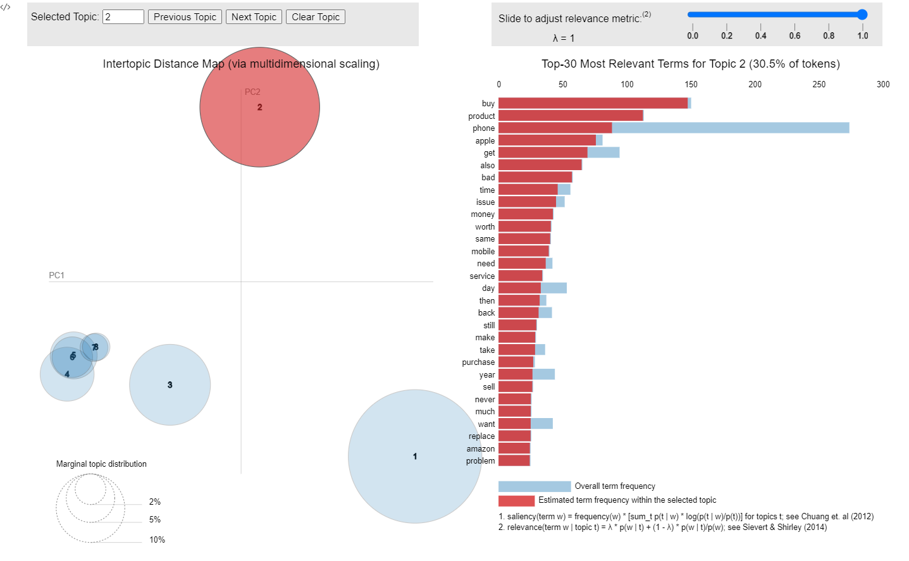
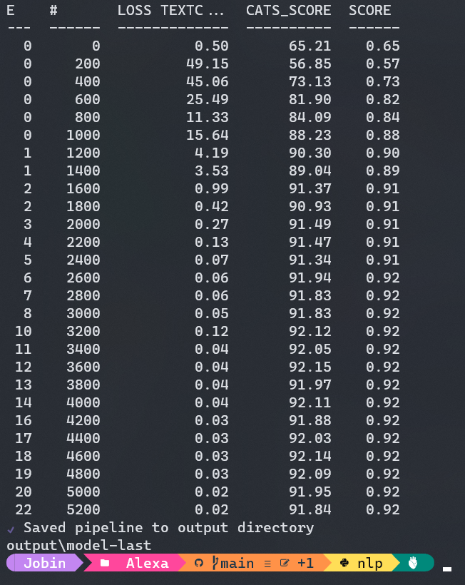

# Sentiment Analysis

## Overview

- Web Scraping amazon reviews
- Topic Modeling
- Text Classification

## [Web Scraping](https://github.com/Jobin-Nelson/Sentiment_analysis/tree/main/scrape_reviews)

I used [scrapy](https://docs.scrapy.org/en/latest/intro/overview.html) to scrape reviews from amazon. It can be done using [requests](https://docs.python-requests.org/projects/requests-html/en/latest/) module as well. However, it isn’t reliable as scrapy as it handles errors and latency natively making things way easier

- Each product in amazon is identified through a code called asin which should be available on the product page
- After finding the asin you can assign the value to the variable `asin` in the [spider](https://github.com/Jobin-Nelson/Sentiment_analysis/blob/main/scrape_reviews/scrape_reviews/spiders/amazon_reviews.py) file, then it is as easy as running the below command in the command line to get the reviews in a json file

```
scrapy crawl reviews -o product_reviews.json
```

## [Topic Modeling](https://github.com/Jobin-Nelson/Sentiment_analysis/blob/main/iPhone/iPhone_analysis.ipynb)

*Topic Modeling* is an unsupervised machine learning technique which scans an entire corpus to detect and cluster word groups and phrase patterns which helps in identifying possible defects and general theme runnnig through the reviews. I used [gensim](https://radimrehurek.com/gensim/) to perform *Topic Modeling* on [iPhone](https://www.amazon.in/New-Apple-iPhone-12-128GB/product-reviews/B08L5VJWCV/ref=cm_cr_dp_d_show_all_btm?ie=UTF8&reviewerType=all_reviews) reviews. I had to use code snippets from [stackoverlfow](https://stackoverflow.com/questions/24688116/how-to-filter-out-words-with-low-tf-idf-in-a-corpus-with-gensim/35951190) to do tf-idf removal. 

- lemmatized the reviews and then tokenized it
- Tf-idf removal
- Build an LDA model
- [pyLDAvis](https://pyldavis.readthedocs.io/en/latest/readme.html) to visualize the model
  


## [Text Classification](https://github.com/Jobin-Nelson/Sentiment_analysis/blob/main/Alexa/text_class_alexa.ipynb)

I used spacy to perform *Text classification* on [Echo](https://www.amazon.in/Echo-Dot-3rd-Gen/product-reviews/B07PFFMP9P/ref=cm_cr_dp_d_show_all_btm?ie=UTF8&reviewerType=all_reviews) dot. [Spacy](https://spacy.io/) version 3.0 makes it easier to train models, it handles most of configuration stuffs by itself

- We do need to make a binarized train and valid file for the spacy model to train on
- Then you need to make a partial config file which you can copy paste from [spacy](https://spacy.io/usage/training) after selecting relevant components
- Then it is a matter of running the below code in command line to get all the premade configurations in a config.cfg file, which you can choose to tweak later

```
python -m spacy init fill-config base_config.cfg config.cfg
```

- Now you should be able to train the model with the [config.cfg](https://github.com/Jobin-Nelson/Sentiment_analysis/blob/main/Alexa/config.cfg) file

```
python -m spacy train config.cfg --output ./output  --paths.train. ./train.spacy --paths.dev ./dev.spacy
```


- After training you can test the model on test data to evaluate the model’s performance on unseen data

*Tools: scrapy, spacy, gensim, pyLDAvis, scikit-learn* 